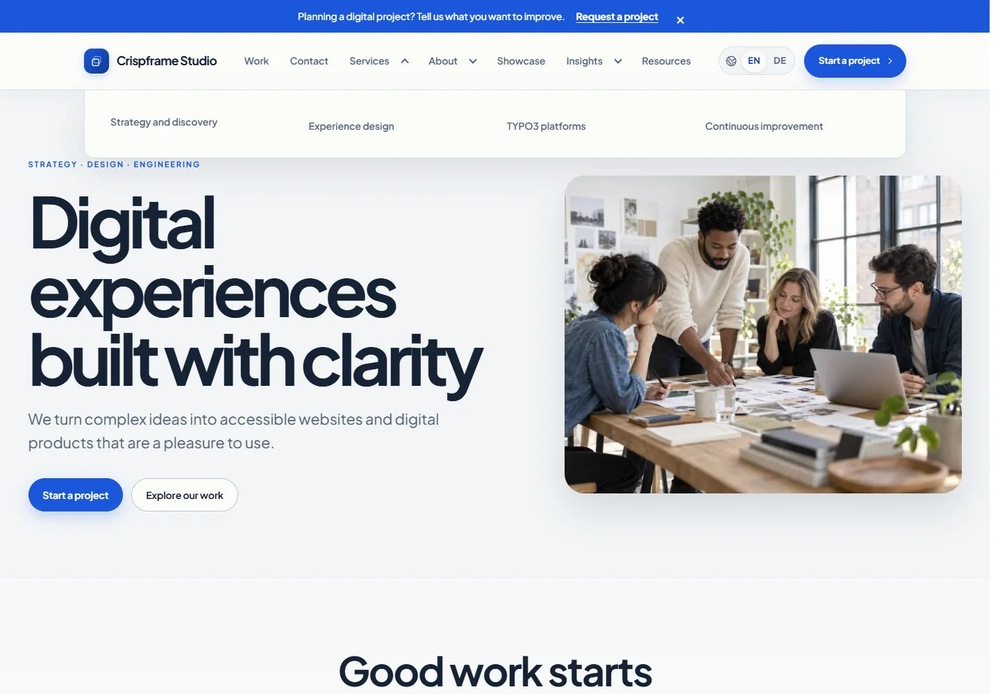

# Crispframe — corporate websites with TYPO3

[](https://packagist.org/packages/crispframe/agency-theme)
[](packages/agency_theme/README.md#requirements)
[](https://github.com/PhantomPixelDev/crispframe/actions/workflows/ci.yml)
[](packages/agency_theme/LICENSE)

A clean, editable TYPO3 website template for agencies, service companies, product teams, and organizations. Build with **27 Content Blocks**, English/German labels, four palettes, and flexible navigation. Fonts, icons, CSS, and vanilla JavaScript are bundled locally.

**[Explore the live demo →](https://dev-crispframe.ppxl.dev/)** · [Browse all elements](https://dev-crispframe.ppxl.dev/components) · [Compare style variants](https://dev-crispframe.ppxl.dev/components/style-variants) · [Installation guide](packages/agency_theme/README.md#installation) · [Report an issue](https://github.com/PhantomPixelDev/crispframe/issues)


## Start here

| What you want to do | Where to start |
| --- | --- |
| Add the theme to an existing TYPO3 site | [Install the Composer extension](#install-in-an-existing-typo3-project) |
| Build a new site with editable examples | [Use the starter](starter/README.md) and optional demo |
| Change branding, menus, colors, or contact details | [First-run checklist](packages/agency_theme/Documentation/FirstRun.md) |
| Develop or contribute to Crispframe | [Development guide](DEVELOPMENT.md) — Docker Compose, checks, and source layout |

## Install in an existing TYPO3 project

Requires TYPO3 **13.4.15+ or 14.3.7+**, within those supported major versions. See the [full requirements](packages/agency_theme/README.md#requirements).

```sh
composer require crispframe/agency-theme:^1.6
vendor/bin/typo3 extension:setup --extension=agency_theme
vendor/bin/typo3 cache:flush
```

In TYPO3 **Site Management → Sites**, add the **Crispframe Agency Theme** Site Set to your site. Select a Crispframe backend layout in the page properties, then add content using the content-element wizard.

**The theme does not import pages.** For a new, empty site with English/German examples, follow the [starter guide](starter/README.md). Docker is optional; it is not required to use the Composer package.

## What you can build

| Toolkit | Included |
| --- | --- |
| Corporate pages | Heroes, services, projects, team, testimonials, pricing, FAQs, galleries, and office locations |
| Longer articles | Article layout with optional sidebar, author cards, pull quotes, tabs, resource lists, and automatic child-page teasers |
| Navigation | Two-level dropdown or mega menus, compact mobile navigation, breadcrumbs, section links, and two footer page trees |
| Inquiries | Contact and project inquiry presets for TYPO3 Form Framework |
| Branding | Four palettes, local Plus Jakarta Sans font, Lucide icons, width/spacing/corner settings, header/footer variants, and [guided block styles](packages/agency_theme/Documentation/StyleVariants.md) |
| Publishing | SEO metadata, sitemap integration, structured data, language switcher, and a branded 404 |

### A closer look

| Two-level mega navigation | Clear, restrained service cards |
| --- | --- |
|  |  |

[See the full screenshot gallery →](packages/agency_theme/Documentation/Screenshots.md)

Screenshots were captured from the development demo on **27 September 2026**. The demo can include fixes ahead of the latest Composer release. Its photographs, copy, and prices are replaceable examples; demo content lives in the optional demo package.

## Make it yours

1. Set your company name, logo, colors, and preferred page width in **Site Settings**.
2. Choose CTA and legal pages with page pickers; review both languages.
3. Build pages from existing blocks or follow a [page recipe](packages/agency_theme/Documentation/PageRecipes.md).
4. Set form recipients and mail transport, then send a test inquiry.
5. Replace example content and complete the [publishing checklist](packages/agency_theme/Documentation/FirstRun.md).

## Packages and documentation

| Package | Purpose |
| --- | --- |
| [Theme](https://github.com/PhantomPixelDev/crispframe-agency-theme) · `crispframe/agency-theme` | Reusable templates, blocks, styles, and Site Settings |
| [Demo](https://github.com/PhantomPixelDev/crispframe-agency-demo) · `crispframe/agency-demo` | Optional example pages and images, for empty sites only |
| [Starter](starter/README.md) | A TYPO3 14.3 Composer project using the public theme package |

- [Theme guide](packages/agency_theme/README.md) — installation, blocks, configuration, and forms.
- [SEO setup](packages/agency_theme/Documentation/SeoSetup.md) — sitemap, language URLs, and metadata.
- [Accessibility](packages/agency_theme/Documentation/Accessibility.md) — verification scope and manual checks.
- [Development](DEVELOPMENT.md) · [Release procedure](packages/agency_theme/Documentation/Release.md).

## Contributing and support

Found a bug? [Open an issue](https://github.com/PhantomPixelDev/crispframe/issues) with the TYPO3 and Crispframe versions, the affected page or block, steps to reproduce, and a screenshot when useful. Keep credentials and private site data out of reports.

Crispframe is licensed under [GPL-2.0-or-later](packages/agency_theme/LICENSE). Bundled font and icon notices are included in the theme.
